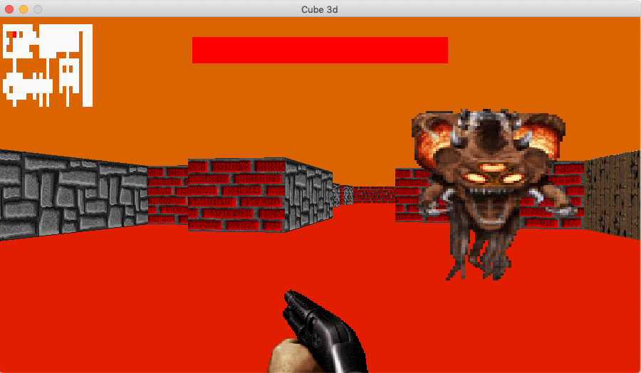

# wolf3d @ 42



A simple ray casting engine made in C using minilibX, with textures, basic
lighting and basic map files.

## Compiling
Run `make`. Runs on Mac OS X and Linux (with XServer).

## Running
Run `./cube3d [map_file]`, a window should appear. You can navigate through the
map using the arrow keys. Exit by closing the window or pressing ESC. Show a bill
buy pressing E, reload the weapon with SPACE.

## Map file format
Just edit the map.cub file, you can specify the color of the ceilling, the color of
the floor, the resolution and different texture depending on if the wall face the
north, east, west or south.

Then the actual map is represented by a grid of integer, 1 being a wall, 0 empty
space and 2 a sprite. You need to specify a spawn point with one of the letters
N, S, E, and W depe on where you want to look  when you spawn.
```
1 1 1 1 1
1 0 2 0 1
1 0 0 S 1
1 1 1 1 1
```

## License
This project is licensed under the GNU General Public License 3.
